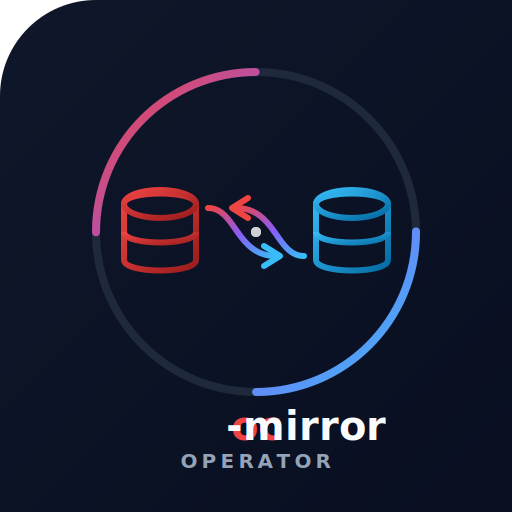

<p align="center">
  
</p>

# oc-mirror-operator

The `oc-mirror-operator` is a Kubernetes operator for automating and continuously mirroring OpenShift Releases, operator catalogs, and additional container images into a private registry.

Unlike the static `oc-mirror` CLI tool, this operator works cloud-natively and declaratively. It orchestrates mirroring workflows directly in the cluster — without persistent storage, without external dependencies, and with full Kubernetes integration via Custom Resources.

---

## Feature Comparison: oc-mirror-operator vs. oc-mirror CLI

### ✅ Implemented Features

| Feature | oc-mirror CLI | oc-mirror-operator | Notes |
|---------|:---:|:---:|-------------|
| **OpenShift Release Mirroring** | ✅ | ✅ | Cincinnati graph resolution, version ranges, BFS shortest path, full-channel mode |
| **Release Component Images** | ✅ | ✅ | Automatic extraction of all ~190 component images from the release payload |
| **Multi-Architecture Support** | ✅ | ✅ | `architectures: [amd64, arm64, ...]` — multi-arch manifest resolution |
| **OCP and OKD** | ✅ | ✅ | `type: ocp` (default) or `type: okd` |
| **Operator Catalog Mirroring** | ✅ | ✅ | FBC parsing, package filtering, bundle image extraction with automatic dependency resolution |
| **Operator Dependency Resolution** | ✅ | ✅ | Transitive BFS resolution of `olm.package.required`, `olm.gvk.required` and companion packages (e.g. `odf-operator` → `odf-dependencies`) |
| **Filtered Catalog Image (OLM v0+v1)** | ✅ | ✅ | Source image as base + FBC overlay layer with opaque whiteouts — compatible with CatalogSource (gRPC) and ClusterCatalog |
| **Package/Channel Filtering** | ✅ | ✅ | Individual packages and channels selectable; heads-only default (oc-mirror v2 compatible) |
| **Version Ranges (Operators)** | ✅ | ✅ | `minVersion` / `maxVersion` per package or channel |
| **Head+N Mode** | ✗ | ✅ | `previousVersions` field includes N older versions behind the channel head |
| **Additional Images** | ✅ | ✅ | Individual images with optional `targetRepo` / `targetTag` |
| **Cosign Signatures** | ✅ | ✅ | Tag-based `.sig` signatures are automatically copied along |
| **OCI Referrers** | ✅ | ✅ | Attestations, SBOMs via `regclient.ImageWithReferrers()` |
| **Release Signatures** | ✅ | ✅ | Download from mirror.openshift.com/pub/openshift-v4/signatures |
| **IDMS/ITMS Generation** | ✅ | ✅ | ImageDigestMirrorSet and ImageTagMirrorSet — provided via Resource API |
| **Incremental Mirroring** | ✅ | ✅ | Already mirrored images are skipped (consolidated per-MirrorTarget state) |
| **Registry Drift Detection** | ✗ | ✅ | Manager verifies every 5 min whether mirrored images still exist in the registry; missing ones are automatically re-mirrored. Auth token refresh every 20 checks prevents Quay nginx 8KB header limit |
| **Per-Image Timeout** | ✗ | ✅ | 20 min timeout per image mirror prevents stalled uploads from blocking the worker |
| **Automatic Retries** | ✗ | ✅ | Up to 10 retries per image on failure |
| **Continuous Mirroring** | ✗ | ✅ | Reconcile loop every 30s — new images are automatically detected and mirrored |
| **Periodic Upstream Polling** | ✗ | ✅ | Configurable `pollInterval` (default: 24h) periodically checks whether new releases or operator versions are available. Failed images are automatically retried on the next poll |
| **Image Cleanup on Removal** | ✗ | ✅ | Annotation-controlled deletion: when removing an ImageSet or on spec changes (operator removed, version range restricted), images no longer needed are deleted from the registry via a cleanup job |
| **Declarative via CRDs** | ✗ | ✅ | `MirrorTarget` (target + ImageSet list) + `ImageSet` (content definition) custom resources |
| **Scalable Worker Pods** | ✗ | ✅ | Configurable concurrency (up to 100 pods) and batch size (up to 100 images/pod) |
| **Ephemeral Volume Blob Buffering** | ✗ | ✅ | Large blobs (>100 MiB) are buffered on emptyDir — no OOM with multi-GB layers |
| **Blob Replication Planning** | ✗ | ✅ | Greedy set cover algorithm optimizes mirror order for maximum blob reuse |
| **Automatic Catalog Rebuild** | ✗ | ✅ | Build signature detects changes to packages/catalogs and triggers automatic rebuild |
| **Resource API + Web UI** | ✗ | ✅ | IDMS, ITMS, CatalogSource, ClusterCatalog and signature ConfigMaps retrievable via REST API + Web Dashboard — with OpenShift Route, Ingress or Service |
| **Worker Pod Lifecycle** | ✗ | ✅ | Automatic cleanup of completed/failed worker and orphan pods |
| **KubeVirt Container Disk** | ✅ | ✅ | `platform.kubeVirtContainer: true` extracts KubeVirt disk images from the release payload (RHCOS per architecture) |

### ⚠️ Partially Implemented

| Feature | oc-mirror CLI | oc-mirror-operator | Status |
|---------|:---:|:---:|--------|
| **GatewayAPI Exposure** | ✗ | ⚠️ | API field defined (`spec.expose.type: GatewayAPI`), HTTPRoute creation not yet implemented |

### ❌ Not Implemented Features

| Feature | oc-mirror CLI | oc-mirror-operator | Note |
|---------|:---:|:---:|-----------|
| **Blocked Images** | ✅ | ❌ | API field `blockedImages` exists but is not evaluated anywhere |
| **Helm Chart Mirroring** | ✅ | ❌ | Complete API types defined (`Helm`, `Repository`, `Chart`), but collector ignores `spec.mirror.helm` |
| **Mirror-to-Disk** | ✅ | ❌ | `oc-mirror` can mirror to a local archive — no equivalent in the operator (not meaningful in cluster context) |
| **Disk-to-Mirror** | ✅ | ❌ | `oc-mirror` can mirror from a local archive to a registry — `platform.release` field exists but is not used |
| **Enclave Support** | ✅ | ❌ | No concept for air-gap transfer via media — the operator requires network access to both source and target registry |
| **UpdateService CR** | ✅ | ❌ | `oc-mirror` generates an UpdateService CR for OSUS — not implemented |
| **Cincinnati Graph Data** | ✅ | ❌ | `platform.graph: true` field exists, but graph data is not pushed to the target registry |
| **Samples** | ✅ | ❌ | API field exists, explicitly marked as "not implemented" |

### Operator-Specific Features (no equivalent in oc-mirror CLI)

| Feature | Description |
|---------|-------------|
| **Cloud-Native Orchestration** | Runs as a Kubernetes operator in the cluster — no manual CLI invocation needed |
| **Worker Pod Architecture** | Parallel worker pods with configurable concurrency and batch size |
| **Authenticated Status API** | Workers report results via a Bearer-token-protected HTTP endpoint |
| **ConfigMap-Based State** | Gzip-compressed image state in ConfigMaps (~30 bytes/image) — no PV needed |
| **Restricted Pod Security** | All pods run with `runAsNonRoot`, drop-all-capabilities, Seccomp |
| **Namespace-Scoped RBAC** | No ClusterRole — all permissions scoped to the operator namespace |
| **Registry Existence Check** | Periodic check whether images still exist in the target registry |
| **Quay Compatibility** | Special blob buffering for Quay registries (upload session timeout workaround) |
| **Auth Token Refresh** | Automatic registry client reset every 20 operations in drift detection, worker batches and cleanup jobs — prevents Quay nginx 8KB header overflow |
| **Blob Replication Planning** | Greedy set cover optimizes mirror order: shared layers are pushed first → subsequent images use blob mount (zero-copy) |
| **Catalog Build Signature** | SHA256 hash over operator image + catalog + package list automatically detects when a rebuild is needed |
| **Resource API + Web UI** | Provides IDMS/ITMS, CatalogSource, ClusterCatalog and signature ConfigMaps via REST API + Web Dashboard — Route (OpenShift), Ingress or Service |
| **HTTP Proxy Support** | Configurable `spec.proxy` injects HTTP/HTTPS/NO_PROXY into all pods for corporate proxy environments |
| **Custom CA Bundle** | `spec.caBundle` mounts a ConfigMap-based CA into all pods and sets `SSL_CERT_FILE` — supports private registries with custom CAs |
| **Ephemeral PVC for Large Images** | `spec.workerStorage` replaces the default emptyDir with a dynamically-provisioned PVC (generic ephemeral volume) for LLMs and other oversized images |

---

## Architecture

The oc-mirror operator now uses a **modular 3-component architecture** for improved scalability, maintainability, and independent deployment:

### Component Overview

| Component | Binary | Container Image | Purpose |
|-----------|--------|------------------|---------|
| **Controller** | `oc-mirror-controller` | `oc-mirror-controller:v0.1.0+` | Kubernetes operator managing MirrorTarget/ImageSet CRs, deploying Manager Pods, creating Cleanup Jobs |
| **Manager** | `oc-mirror-manager` | `oc-mirror-manager:v0.1.0+` | Per-MirrorTarget orchestrator: manages Worker Pod batches, owns ImageState ConfigMap, serves Status API |
| **Worker** | `oc-mirror-worker` | `oc-mirror-worker:v0.1.0+` | Ephemeral Pods for image mirroring; mirrors batches, buffers large blobs, reports progress to Manager |
| **Cleanup** | `oc-mirror-worker cleanup` | `oc-mirror-worker:v0.1.0+` | Job subcommand for deleting orphaned images from target registry |

### Architecture Diagram

```
┌─────────────────────────────────────────────────────────────────────┐
│  Kubernetes Cluster                                                 │
│                                                                     │
│  ┌──────────────────┐   watch   ┌──────────────────────────────┐    │
│  │  ImageSet CR     │◄──────────│                              │    │
│  │  MirrorTarget CR │           │   Controller (1 Deployment)  │    │
│  └──────────────────┘  reconcile│   cmd/controller/main.go     │    │
│                         ───────►│   internal/controller/        │    │
│                                 └──┬──────────────┬────────┬───┘    │
│                                    │ creates      │ creates│creates │
│                                    │ Manager Pod  │ Job    │Deploy  │
│                                    │ Service      │(Cat/   │+Svc    │
│                                    │ Route/Ingress│Cleanup)│(1/ns)  │
│                                    ▼              ▼        ▼        │
│          ┌────────────────────────┐ ┌──────────┐ ┌───────────────┐  │
│          │ Manager Pod (1/Target) │ │ Catalog- │ │ Resource API  │  │
│          │ cmd/manager/main.go    │ │ Builder/ │ │ pkg/resource- │  │
│          │                        │ │ Cleanup  │ │ api/          │  │
│          │ • Loads ImageState CM  │ │ Job      │ │               │  │
│          │ • Manages Worker Queue │ │          │ │ • REST API    │  │
│          │ • Status API :8080     │ │ • FBC    │ │ • Web UI /ui/ │  │
│          │ • Writes Resource CMs  │ │ • OCI    │ │ • Reads CMs   │  │
│          │ • Registry verification│ │ • Push   │ │ • Port :8081  │  │
│          │ • Worker Cleanup       │ │ • Delete │ │               │  │
│          └──────┬─────────────────┘ └──────────┘ └───────┬───────┘  │
│                 │creates Pods (ephemeral)                │          │
│                 │ POST /status           ┌─────────────┴───────┐   │
│          ┌──────▼───────┐                │ Route/Ingress/Svc   │   │
│          │ Worker Pod 1 │                │ → Manager :8080     │   │
│          │ Worker Pod 2 │                │ → Resource API      │   │
│          │ Worker Pod N │                │    :8081            │   │
│          │cmd/worker/   │                │ /api/v1/targets/... │   │
│          │main.go       │                │ /ui/ (Dashboard)    │   │
│          └──────┬───────┘                └─────────────────────┘   │
│                 │ regclient + buffer                               │
│                 ▼                                                   │
│          ┌──────────────────────────────┐                           │
│          │   Target Registry            │                           │
│          └──────────────────────────────┘                           │
└─────────────────────────────────────────────────────────────────────┘
```

### Component Responsibilities

| Component | Responsibilities | Launch | Lifetime |
|-----------|-----------------|--------|----------|
| **Controller** | Reconciles MirrorTarget/ImageSet CRs; creates Manager Deployments; schedules catalog build Jobs; triggers cleanup on deletion; owns RBAC roles | `1×` per operator deployment | Long-lived |
| **Manager** | Orchestrates Workers; loads/updates ImageState ConfigMap; serves Status API; coordinates cleanup; verifies target registry state | `1×` per MirrorTarget | Long-lived (pod restart on error) |
| **Worker** | Mirrors image batches; buffers large layers; reports progress; skips obsolete images; cleans up on exit | `N×` batches (configurable) | Ephemeral (auto-deleted on completion) |
| **Cleanup Job** | Deletes images from target registry when ImageSet is removed or spec is narrowed | `1×` per cleanup operation | Runs to completion, auto-cleaned |

### Data Flow

1. User creates `MirrorTarget` (target registry + ImageSet list) and `ImageSet` (content definition) CRs
2. **Operator** resolves the full image list via Cincinnati API (Releases) and catalog image (Operators) and stores it as a gzip-compressed ConfigMap
3. **Operator** creates catalog builder jobs for each configured operator catalog (with build signature for change detection)
4. **Catalog-Builder** filters FBC, resolves dependencies, builds OCI image and pushes it to the target registry
5. **Manager** loads the image state, plans the mirror order via blob planner, checks whether mirrored images still exist in the target registry and starts worker pods
6. **Worker** copies images (incl. signatures and referrers), buffers large blobs on ephemeral volume and reports results to the manager via `POST /status`
7. Manager cleans up completed/failed worker pods and updates image state and `ImageSet.Status`
8. **Resource API** (standalone Deployment, port 8081) reads generated resource ConfigMaps and serves IDMS, ITMS, CatalogSource, ClusterCatalog and signature ConfigMaps via REST API — resources are only available once the respective ImageSet has reached `Ready` status. A Web UI Dashboard is available at `/ui/`
9. **Periodic Polling**: Operator checks at a configurable interval (`pollInterval`, default: 24h) whether upstream sources (Cincinnati, catalogs) contain new images and triggers re-collection + catalog rebuild as needed
10. **Image Cleanup**: When removing an ImageSet from the MirrorTarget or on spec changes (e.g. operator removed), the operator creates cleanup jobs that delete images no longer needed from the target registry (annotation-controlled)
11. **Live-Skip of Obsolete Images**: If the user reduces an ImageSet (operator removed, version range restricted) while workers are already running, each worker queries the manager via `GET /should-mirror?dest=...` before copying. If the manager responds with `410 Gone` (image no longer in current state or already mirrored), the worker skips the image. This avoids consuming bandwidth and registry storage for now-obsolete images. Worst-case latency until skip: one manager reconcile cycle (~30 s).

---

## Operator Catalog System

The operator builds filtered OCI catalog images compatible with **OLM v0** (CatalogSource/gRPC) and **OLM v1** (ClusterCatalog).

### Dependency Resolution

When filtering an operator catalog, all transitive dependencies are automatically resolved via **BFS traversal**:

| Dependency Type | Description | Example |
|----------------|-------------|---------|
| `olm.package.required` | Direct package dependencies from bundle properties | `odf-dependencies` requires `cephcsi-operator` |
| `olm.gvk.required` | GVK dependencies (Group/Version/Kind), resolved to the provider package | Bundle requires `StorageCluster` API → `ocs-operator` |
| Companion packages | Red Hat naming convention: `<name>-dependencies`, `<name>-deps` | `odf-operator` → `odf-dependencies` |

### Heads-Only Filtering (oc-mirror v2 Compatible)

When a package is listed without explicit channels or version ranges, the operator
uses **heads-only** mode — only the channel head (latest version) of every channel
is included. This matches the behaviour of `oc-mirror v2`.

| Configuration | Behaviour |
|---|---|
| `packages` omitted or `full: true` | Full catalog — all packages, all versions |
| `packages: [{name: X}]` | Heads-only: latest version of every channel in package X |
| `packages: [{name: X, previousVersions: 2}]` | Head + 2 previous versions per channel |
| `packages: [{name: X, channels: [{name: stable}]}]` | All versions in the specified channel(s) |
| `packages: [{name: X, minVersion: "1.0", maxVersion: "2.0"}]` | Version range filter across all channels |

### Filtered Catalog Image (OCI Layer Architecture)

```
┌──────────────────────────────────────────┐
│  Layer 6: Filtered FBC Overlay (new)     │  ← configs/<pkg>/catalog.yaml
│           + Opaque Whiteouts             │  ← configs/.wh..wh..opq
│           + Cache Invalidation           │  ← tmp/cache/.wh..wh..opq
├──────────────────────────────────────────┤
│  Layer 5: Original FBC (full catalog)    │  ← covered by whiteout
│  Layer 4: opm Binary + Tools             │
│  Layer 3: OS Dependencies                │
│  Layer 2: Base OS (RHEL UBI)             │
│  Layer 1: Root Filesystem                │
└──────────────────────────────────────────┘
```

- **Source image as base**: All original layers are taken over via blob copy (retains `opm` binary, entrypoint, OS)
- **FBC overlay**: New layer with filtered FBC + OCI Opaque Whiteout (`configs/.wh..wh..opq`) covers the full catalog
- **Cache invalidation**: Opaque whiteout for `/tmp/cache/` removes the pre-built `opm` cache; `--cache-enforce-integrity=false` in the image command allows rebuilding
- **OLM label**: `operators.operatorframework.io.index.configs.v1=/configs` for compatibility with both OLM versions

### Build Signature and Automatic Rebuild

Catalog builds are managed via a **build signature** (SHA256 hash):
- Input: Operator image + catalog URLs + full flag + sorted package names
- Stored as annotation: `mirror.openshift.io/catalog-build-sig`
- On signature change (new package, changed catalog): old job is deleted, new build started

### Catalog-Builder Job

One Kubernetes Job is created per source catalog:
- Container: Same operator image, entrypoint `/catalog-builder`
- Configuration via environment variables: `SOURCE_CATALOG`, `TARGET_REF`, `CATALOG_PACKAGES`
- emptyDir volume `/tmp/blob-buffer` for large layer blobs
- Max 3 retries, 10 minute TTL after completion

---

## Blob Replication Planning

The manager optimizes the mirror order using a **Greedy Set Cover algorithm** (`PlanMirrorOrder`):

1. **Phase 1**: Fetch manifests of all images, collect blob digests per image
2. **Phase 2**: Count blob frequency (how many images reference each blob)
3. **Phase 3**: Greedy sorting:
   - **First image**: The one whose blobs appear in the most other images (shared layers are pushed first)
   - **Subsequent images**: Prefer images with the most already-uploaded blobs (maximizes blob mount hits)

**Effect**: Blobs pushed by an earlier image are linked by `regclient` via anonymous blob mount (zero-copy) — no additional data transfer needed.

---

## KubeVirt Container-Disk-Images

When `platform.kubeVirtContainer: true` is set, the operator extracts the **KubeVirt Container-Disk-Images** (RHCOS-based) from the release payload and mirrors them automatically.

### How It Works

1. The collector reads the `0000_50_installer_coreos-bootimages` ConfigMap from the release payload
2. The `kubevirt.digest-ref` entries per architecture are extracted from the embedded CoreOS stream JSON
3. The images are mirrored into the target registry like regular component images

### Architecture Mapping

| ImageSet `architectures` | CoreOS Stream Architecture | KubeVirt available |
|--------------------------|--------------------------|-------------------|
| `amd64` | `x86_64` | ✅ |
| `s390x` | `s390x` | ✅ |
| `arm64` | `aarch64` | ❌ (not in all releases) |
| `ppc64le` | `ppc64le` | ❌ (not in all releases) |

> **Note**: Not all architectures have KubeVirt images. Missing architectures are skipped, not reported as errors.

---

## Resource API (HTTP + Web UI)

The Resource API runs as a **standalone Deployment** (`oc-mirror-resource-api`, one per namespace) and provides cluster resources via REST API and an embedded Web UI Dashboard. The Manager writes generated resources (IDMS, ITMS, CatalogSource, etc.) to ConfigMaps during each reconcile cycle; the Resource API reads these ConfigMaps and serves them over HTTP on port **8081**.

### Architecture

```
Manager Pod                          Resource API Pod
┌──────────────────────┐             ┌─────────────────────────┐
│ Reconcile loop:      │  writes     │ Reads ConfigMaps:       │
│ • Generate IDMS/ITMS │──────────►  │ oc-mirror-<mt>-resources│
│ • Generate CatSrc    │  ConfigMap  │                         │
│ • Generate packages  │             │ Serves:                 │
└──────────────────────┘             │ • REST API /api/v1/...  │
                                     │ • Web UI /ui/           │
                                     │ • Legacy /resources/... │
                                     └─────────────────────────┘
```

### Endpoints

| Endpoint | Resource | Description |
|----------|-----------|-------------|
| `GET /api/v1/targets` | JSON | List of all MirrorTargets with status and ImageSets |
| `GET /api/v1/targets/{mt}` | JSON | Detail view of a MirrorTarget with ImageSet status and resource links |
| `GET /api/v1/targets/{mt}/imagesets/{is}/idms.yaml` | `ImageDigestMirrorSet` | Digest-based mirror rules for all mirrored images |
| `GET /api/v1/targets/{mt}/imagesets/{is}/itms.yaml` | `ImageTagMirrorSet` | Tag-based mirror rules (if tag-based images are present) |
| `GET /api/v1/targets/{mt}/imagesets/{is}/catalogs/{name}/catalogsource.yaml` | `CatalogSource` | OLM v0-compatible CatalogSource (gRPC) for the filtered catalog |
| `GET /api/v1/targets/{mt}/imagesets/{is}/catalogs/{name}/clustercatalog.yaml` | `ClusterCatalog` | OLM v1-compatible ClusterCatalog resource |
| `GET /api/v1/targets/{mt}/imagesets/{is}/catalogs/{name}/packages.json` | JSON | All packages, channels, and versions from the filtered catalog |
| `GET /api/v1/targets/{mt}/imagesets/{is}/signature-configmaps.yaml` | ConfigMaps | Release signature ConfigMaps in OpenShift verification format |
| `GET /ui/` | HTML | Web UI Dashboard with mirroring progress and resource download links |

### Legacy Compatibility

Old `/resources/{imageset}/...` URLs are redirected to the new `/api/v1/...` paths for backward compatibility during migration.

### Ready-Gating

Resources are only served once the associated ImageSet has reached `Ready` status. The target list endpoint (`/api/v1/targets`) shows the `ready` status for each ImageSet.

### Web UI Dashboard

The embedded dashboard at `/ui/` provides:
- **Overview**: All MirrorTargets with progress bars (Total/Mirrored/Pending/Failed)
- **Target Detail**: ImageSets with status and available resources as download links
- Auto-refresh every 30 seconds
- Dark theme, plain HTML + CSS + Vanilla JS (no framework dependencies)

### Exposure Options

External accessibility is configured via `MirrorTarget.spec.expose`:

| Type | Description | Automation |
|-----|-------------|-----------|
| **Route** (default on OpenShift) | OpenShift Route with edge TLS termination | Auto-detection via Route API discovery |
| **Ingress** | `networking.k8s.io/v1` Ingress | Requires `host` and optionally `ingressClassName` |
| **GatewayAPI** | Gateway API HTTPRoute | API field defined, implementation pending |
| **Service** (default on K8s) | ClusterIP service only, no external exposure | Fallback when no Route API is available |

When switching the exposure type (e.g. Route → Ingress), stale objects are automatically cleaned up.

### Example Usage

```bash
# List all targets
curl -sk https://<route-host>/api/v1/targets | jq .

# Target detail with ImageSet status
curl -sk https://<route-host>/api/v1/targets/internal-registry | jq .

# Apply IDMS directly
curl -sk https://<route-host>/api/v1/targets/internal-registry/imagesets/ocp-release-4-21/idms.yaml | kubectl apply -f -

# CatalogSource for filtered operator catalog
curl -sk https://<route-host>/api/v1/targets/internal-registry/imagesets/ocp-release-4-21/catalogs/redhat-operator-index/catalogsource.yaml | kubectl apply -f -

# Open Web UI Dashboard
open https://<route-host>/ui/
```

---

## Custom Resources

### MirrorTarget

Defines the mirror target and pod configuration.

```yaml
apiVersion: mirror.openshift.io/v1alpha1
kind: MirrorTarget
metadata:
  name: internal-registry
  namespace: oc-mirror-system
  annotations:
    # Opt-in: automatically delete images on removal (default: no cleanup)
    mirror.openshift.io/cleanup-policy: Delete
spec:
  # Target registry incl. base path (required)
  registry: "registry.example.com/mirror"

  # List of ImageSets to mirror into this target (required)
  # Each ImageSet may only be referenced in one MirrorTarget.
  imageSets:
    - ocp-4-21-sync
    - additional-tools

  # Reference to a secret with registry credentials (recommended)
  authSecret: "target-registry-creds"

  # For registries with self-signed certificates or plain HTTP
  # TLS fallback: tries plain HTTP first, falls back to HTTPS without verification
  insecure: false

  # Upstream polling interval (default: 24h, min: 1h, 0 = disabled)
  # Periodically checks whether new releases or operator versions are available
  pollInterval: 24h

  # Concurrency: max. concurrent worker pods (default: 1, max: 100)
  # Default 1 optimized for Quay: sequential mirroring enables
  # blob mount (zero-copy) of previously pushed blobs.
  concurrency: 1

  # Images per worker pod (default: 50, max: 100)
  batchSize: 50

  # Resource server exposure (optional)
  # On OpenShift a Route is automatically created if not configured.
  expose:
    # Options: Route (default on OpenShift), Ingress, GatewayAPI, Service
    type: Route
    # External hostname (optional — auto-generated for Route)
    # host: "mirror-resources.example.com"

  # Resources for worker pods (optional)
  worker:
    resources:
      requests: { cpu: "200m", memory: "256Mi" }
      limits:   { cpu: "1000m", memory: "1Gi" }
    nodeSelector: {}
    tolerations: []
```

### ImageSet

Defines which content should be mirrored. An ImageSet is assigned via the
`imageSets` field of the MirrorTarget — it does not itself contain a
reference to a target.

```yaml
apiVersion: mirror.openshift.io/v1alpha1
kind: ImageSet
metadata:
  name: ocp-4-21-sync
  namespace: oc-mirror-system
spec:
  mirror:
    # OpenShift / OKD Platform Releases
    platform:
      architectures: ["amd64"]
      kubeVirtContainer: true  # also mirror KubeVirt Container-Disk-Images
      channels:
        - name: stable-4.21
          type: ocp
          minVersion: "4.21.0"
          maxVersion: "4.21.9"
          shortestPath: true

    # OLM Operator catalogs (with automatic dependency resolution)
    operators:
      - catalog: "registry.redhat.io/redhat/redhat-operator-index:v4.21"
        packages:
          - name: odf-operator
            # Dependencies (odf-dependencies, cephcsi-operator, etc.)
            # are automatically resolved and mirrored

    # Individual additional images
    additionalImages:
      - name: "registry.redhat.io/ubi9/ubi:latest"
      - name: "quay.io/prometheus/prometheus:v2.45.0"
        targetRepo: "custom/prometheus"
        targetTag: "v2.45.0"
```

**Status Fields:**

| Field | Description |
|------|-------------|
| `status.totalImages` | Total number of images to mirror |
| `status.mirroredImages` | Successfully mirrored images |
| `status.pendingImages` | Pending images |
| `status.failedImages` | Failed images |
| `status.lastSuccessfulPollTime` | Timestamp of the last successful upstream poll |
| `status.conditions[Ready]` | `True` when collection is successful |

**MirrorTarget Status (aggregated over all referenced ImageSets):**

The `MirrorTarget` additionally exposes the per-ImageSet counters cumulatively, so `oc get mirrortarget` directly shows the overall progress:

```bash
$ oc get mirrortarget
NAME            TOTAL   MIRRORED   PENDING   FAILED   AGE
quay-internal   757     756        1         0        2d19h
```

| Field | Description |
|------|-------------|
| `status.totalImages` | Sum of all `ImageSet.status.totalImages` |
| `status.mirroredImages` | Sum of all `ImageSet.status.mirroredImages` |
| `status.pendingImages` | Sum of all `ImageSet.status.pendingImages` |
| `status.failedImages` | Sum of all `ImageSet.status.failedImages` |
| `status.imageSetStatuses[]` | Per-ImageSet breakdown (Name, Found, Total, Mirrored, Pending, Failed) — sorted alphabetically |

Aggregation is triggered by a watch on `ImageSet` status changes: as soon as an ImageSet updates its counters, all MirrorTargets that reference this ImageSet in `spec.imageSets` are automatically reconciled.

**Image States (in ConfigMap state):**

| State | Meaning |
|-------|-----------|
| `Pending` | Waiting for worker pod |
| `Mirrored` | Successfully mirrored (digest verified) |
| `Failed` | Error — automatically retried up to 10× |

---

## Target Path Mapping

The operator maps source images to target paths as follows:

| Type | Source | Target |
|-----|--------|------|
| **Release-Payload** | `quay.io/openshift-release-dev/ocp-release:4.21.9-x86_64` | `registry/openshift-release-dev/ocp-release:4.21.9` |
| **Release-Component** | `quay.io/openshift-release-dev/ocp-v4.0-art-dev@sha256:abc123...` | `registry/openshift-release-dev/ocp-v4.0-art-dev:sha256-abc123...` |
| **KubeVirt Disk** | `quay.io/openshift-release-dev/ocp-v4.0-art-dev@sha256:5ce03d...` | `registry/openshift-release-dev/ocp-v4.0-art-dev:sha256-5ce03d...` |
| **Operator-Bundle** | `registry.redhat.io/openshift-gitops-1/argocd-rhel8@sha256:def456...` | `registry/openshift-gitops-1/argocd-rhel8:sha256-def456...` |
| **Additional Image** | `quay.io/prometheus/prometheus:v2.45.0` | `registry/prometheus/prometheus:v2.45.0` |

Here `registry` is replaced by the value from `MirrorTarget.spec.registry`. The upstream repository path is preserved.

---

## Blob Buffering for Large Images

Worker pods use an **emptyDir Ephemeral Volume** (`/tmp/blob-buffer`) to buffer large blobs (>100 MiB) before upload. This works around a Quay-specific issue where upload sessions expire during slow cross-registry transfers.

The process for large blobs:
1. Blob is downloaded from the source registry and written to a temp file
2. Monolithic PUT from the local file to the target registry (fast)
3. Temp file is deleted after upload

Advantages over RAM buffering: No OOM risk with multi-GB layers.

### Ephemeral PVC for Very Large Images (LLMs etc.)

For images that exceed the default 10 GiB emptyDir limit (e.g. LLM model images or large AI datasets), configure `spec.workerStorage`:

```yaml
spec:
  workerStorage:
    storageClassName: fast-ssd  # omit to use cluster default
    size: 200Gi
```

When `workerStorage` is set, worker pods use a **generic ephemeral PVC** instead of emptyDir. Kubernetes binds the PVC to the pod lifecycle — the PVC is automatically deleted when the worker pod is deleted. No manual cleanup is required.

---

## HTTP Proxy Configuration

If worker, manager, and catalog-builder pods must reach upstream registries through a corporate HTTP proxy, configure `spec.proxy`:

```yaml
spec:
  proxy:
    httpProxy: "http://proxy.corp.example.com:3128"
    httpsProxy: "http://proxy.corp.example.com:3128"
    # Optional: additional NO_PROXY exclusions (e.g. pod CIDR, custom domains)
    # noProxy: "10.128.0.0/14,custom.internal.domain"
```

Both uppercase (`HTTP_PROXY`, `HTTPS_PROXY`, `NO_PROXY`) and lowercase (`http_proxy`, `https_proxy`, `no_proxy`) env vars are injected for maximum tool compatibility.

When `httpProxy` or `httpsProxy` is set, the operator **automatically** injects the following into `NO_PROXY`:

```
localhost,127.0.0.1,.svc,.svc.cluster.local
```

This ensures pod-to-pod traffic via cluster-internal FQDNs (e.g. the manager service at `<target>-manager.<namespace>.svc.cluster.local`) always bypasses the proxy without manual configuration.

In addition, `KUBERNETES_SERVICE_HOST` is overridden to `kubernetes.default.svc.cluster.local` so that `client-go`'s in-cluster config also bypasses the proxy when calling the Kubernetes API (Kubernetes auto-injects `KUBERNETES_SERVICE_HOST` as a ClusterIP which would not match FQDN-based NO_PROXY patterns otherwise).

The `spec.proxy.noProxy` field is only needed for **additional** exclusions such as the pod CIDR or custom internal domains.

---

## Custom CA Bundle

To trust a custom or private CA when connecting to upstream registries or the target registry, create a ConfigMap containing the PEM-encoded CA bundle and reference it in `spec.caBundle`:

```bash
kubectl create configmap custom-ca \
  --from-file=ca-bundle.crt=/path/to/ca-chain.pem \
  -n <namespace>
```

```yaml
spec:
  caBundle:
    configMapName: custom-ca
    key: ca-bundle.crt  # optional, defaults to "ca-bundle.crt"
```

The ConfigMap is mounted into worker, manager, and catalog-builder pods at `/run/secrets/ca/`. The `SSL_CERT_FILE` environment variable is set accordingly so that the Go TLS stack and all tools in the operator image trust the bundle.

---

## Drift Detection

The manager checks every **5 minutes** whether all images marked as `Mirrored` still exist in the target registry (HEAD request on the manifest). Missing images are automatically re-queued and re-mirrored.

### Auth-Token-Refresh

Registry clients (regclient) accumulate OAuth scopes per repository in a single Bearer token. After ~40 repositories the token exceeds the **nginx header limit** (8 KB) of Quay proxies, causing `HTTP 400` errors.

**Solution**: Every **20 operations** a fresh registry client with an empty token cache is created. This pattern is applied in three components:
- **Drift Detection** (Manager): Every 20 CheckExist calls + at the start of each drift cycle
- **Worker batches**: The `MirrorClient` in the worker pod is renewed every 20 images
- **Cleanup jobs**: Every 20 manifest deletions in the cleanup job

### Error Handling

| Scenario | Behavior |
|----------|----------|
| Image not found (404) | Marked as `Pending` → will be re-mirrored |
| Auth/network error | Image assumed **present** (conservative) |
| Registry unreachable | Drift check is skipped, next cycle in 5 min. |

---

## Periodic Upstream Polling

The operator periodically checks whether upstream sources (Cincinnati API for releases, catalog images for operators) contain new content. This way new OCP releases and operator versions are automatically detected and mirrored.

### Configuration

```yaml
apiVersion: mirror.openshift.io/v1alpha1
kind: MirrorTarget
spec:
  # Polling interval (default: 24h, minimum: 1h, 0 = disabled)
  pollInterval: 24h
```

### Behavior

| Aspect | Details |
|--------|---------|
| **Default interval** | 24 hours — checks once daily for new upstream content |
| **Minimum** | 1 hour — shorter values are already rejected by the API server (CRD CEL validation) |
| **Disable** | `pollInterval: 0s` — no automatic polling |
| **What is checked** | Cincinnati graph (new releases in channels), operator catalog images (new bundles/versions) |
| **On new content** | Re-collection of images, automatic catalog rebuild, new images are inserted as `Pending` |
| **Failed images** | On the next poll, `Failed` images are automatically reset to `Pending` and retried |
| **Status tracking** | `ImageSet.status.lastSuccessfulPollTime` shows the timestamp of the last successful poll |
| **Restart persistence** | Controller manager uses `SyncPeriod: 1h` + `RequeueAfter` — polling survives pod restarts and resumes at the next scheduled time |

---

## Image Cleanup

When removing ImageSets or on spec changes, images that are no longer needed can be automatically deleted from the target registry. Cleanup is opt-in and controlled via an annotation.

### Activation

```yaml
apiVersion: mirror.openshift.io/v1alpha1
kind: MirrorTarget
metadata:
  annotations:
    mirror.openshift.io/cleanup-policy: Delete
```

Without this annotation, removed images are **not** deleted from the registry — they remain as orphans (safer default).

### Cleanup Scenarios

| Scenario | Trigger | Behavior |
|----------|----------|----------|
| **ImageSet removed** | ImageSet name removed from `spec.imageSets` | MirrorTarget controller creates cleanup job → deletes all images of the ImageSet → deletes state ConfigMap |
| **Spec change** (intra-ImageSet) | Operator removed, version range restricted, channel removed | ImageSet controller detects diff (before - after) → creates partial cleanup job → deletes only the removed images |

### Technical Details

- **Cleanup jobs**: Kubernetes Jobs using the operator image in `cleanup` mode. Same auth configuration as worker pods.
- **Full cleanup** (ImageSet removed): Job reads the image state from the existing ConfigMap, deletes each manifest via `DELETE` API call, then deletes the ConfigMap itself.
- **Partial cleanup** (spec change): Removed images are stored in a temporary ConfigMap `cleanup-partial-<imageset>-gen<N>` (immutable per generation). Job reads the temp ConfigMap, deletes the images and removes the temp ConfigMap.
- **Auth token refresh**: Cleanup jobs create a fresh registry client every 20 delete operations (same Quay nginx workaround as drift detection and workers).
- **Direct ImageSet deletion (`oc delete imageset <name>`)**: Triggers **no** cleanup. This is intentional — ImageSets have no finalizer, so operators can deliberately remove an ImageSet from a MirrorTarget (which triggers cleanup) before deleting the object itself. To actively remove images from the registry, first remove the entry from `MirrorTarget.spec.imageSets` and only delete the ImageSet resource after the cleanup job completes.

### Status Conditions on MirrorTarget

| Condition | Status | Reason | Meaning |
|-----------|--------|--------|-----------|
| `Cleanup` | `True` | `CleanupInProgress` | Cleanup job is running |
| `Cleanup` | `True` | `CleanupComplete` | Cleanup successfully completed |
| `Cleanup` | `True` | `CleanupError` | Cleanup failed (details in message) |

---

## Prerequisites

- Kubernetes ≥ 1.26 or OpenShift ≥ 4.13
- Access to source registries (pull secret in cluster if required)
- Write access to the target registry (via `authSecret`)

---

## Installation

### 1. Deploy CRDs and Operator

```bash
make install
export IMG=my-registry.example.com/oc-mirror-operator:v0.0.1
make deploy IMG=$IMG
```

### 2. Create Registry Credentials

```bash
kubectl create secret docker-registry target-registry-creds \
  --docker-server=registry.example.com \
  --docker-username=<user> \
  --docker-password=<password> \
  -n oc-mirror-system
```

### 3. Apply MirrorTarget and ImageSet

```bash
kubectl apply -f config/samples/mirror_target_sample.yaml
kubectl apply -f config/samples/imageset_full_sample.yaml
```

### 4. Monitor Status

```bash
# Overview
kubectl get mirrortarget,imageset -n oc-mirror-system

# Progress
kubectl describe imageset ocp-4-21-sync -n oc-mirror-system

# Manager logs
kubectl logs deployment/internal-registry-manager -n oc-mirror-system -f

# Watch worker pods
kubectl get pods -l app=oc-mirror-worker -n oc-mirror-system -w
```

---

## Security Model

### RBAC
The operator runs with a **namespace-scoped `Role`** (not `ClusterRole`). Each layer has a dedicated service account with minimal permissions:

| Service Account | Permissions |
|-----------------|----------------|
| `oc-mirror-operator-controller-manager` | CRD management, Deployments, Services, ConfigMaps, Secrets (read), Routes (including `custom-host`), Ingresses, Roles/RoleBindings (`get;create;update` — no `delete`/`patch`/`escalate`/`bind` verbs to prevent privilege escalation), PersistentVolumeClaims (`get;list;watch;create;delete` — needed so the controller can grant the same to the coordinator Role) |
| `{mt.Name}-coordinator` | ImageSets/ImageSets status (`get;list;watch;update;patch`), MirrorTargets (only `get;list;watch`), Pods (`get;list;watch;create;delete`), ConfigMaps (`get;list;watch;create;update;patch;delete`), worker token secret (`get;list;watch;create;update`), PersistentVolumeClaims (`get;list;create;delete` — for generic ephemeral volumes on worker pods) |
| `{mt.Name}-worker` | No cluster permissions |

> Each `MirrorTarget` creates its own set of RBAC resources named `{mt.Name}-coordinator` and `{mt.Name}-worker`. Multiple `MirrorTarget`s in the same namespace do not conflict. Resources are garbage collected automatically when the `MirrorTarget` is deleted.

> **Upgrade note:** If upgrading from a version that used fixed names (`oc-mirror-coordinator`, `oc-mirror-worker`), those resources will be orphaned. Delete them manually: `kubectl delete sa,role,rolebinding oc-mirror-coordinator oc-mirror-worker -n <namespace>`

### Pod Security
All dynamically created pods (manager and worker) run with **restricted Pod Security Standards**:
- `runAsNonRoot: true`
- `allowPrivilegeEscalation: false`
- `capabilities: drop: ["ALL"]`
- `seccompProfile: RuntimeDefault`

### Worker Authentication
Worker pods authenticate at the manager status endpoint via **Bearer Token**. The token is persisted by the manager at startup in a Kubernetes Secret named `<mirrortarget>-worker-token` (key `token`) (with an OwnerReference on the `MirrorTarget`, so it is automatically cleaned up on deletion). Worker pods read the token via `valueFrom.secretKeyRef` — it does not appear in the pod manifest or logs. The server-side comparison uses `crypto/subtle.ConstantTimeCompare` to prevent timing attacks.

### Registry-Credentials
The `authSecret` is mounted as a volume (`/docker-config/config.json`) in manager and worker pods (only the `config.json` key is projected, other keys in the secret remain invisible). The manager requires read access for drift detection (CheckExist), workers require read/write access for the actual mirroring.

### NetworkPolicies
The operator creates two `NetworkPolicy` objects per `MirrorTarget` in the user namespace (with OwnerReference on the `MirrorTarget`, so they are automatically deleted):

| Policy | Selector | Effect |
|--------|----------|--------|
| `<name>-manager-ingress` | `app=oc-mirror-manager,mirrortarget=<name>` | Ingress only from worker pods of the same `MirrorTarget` on TCP 8080 (status API) and 8081 (resource server) |
| `<name>-worker-ingress-deny` | `app=oc-mirror-worker,mirrortarget=<name>` | Denies all ingress traffic to worker pods (workers are pure clients) |

Both policies only regulate **internal** cluster traffic and are therefore independent of the specific cluster topology (DNS service CIDR, pod CIDR, node-local resolver).

> **Note on worker egress:** Earlier versions of the operator additionally created a `<name>-worker-egress` policy with "DNS + Manager + Internet (except RFC1918)". This policy was removed because it is not reliably predictable where a cluster resolves DNS (service CIDR, openshift-dns pod CIDR, node-local CoreDNS, external resolver) and whether the target registry is in an RFC1918 range — the policy caused DNS timeouts in many cluster topologies. An old policy from earlier deployments is automatically removed by the reconciler.
>
> Users who still want to restrict worker egress can create a custom `NetworkPolicy` with the selector `app=oc-mirror-worker,mirrortarget=<name>` and an egress allow set appropriate for their infrastructure.

### Status-Conditions

Conditions on `MirrorTarget.status.conditions` and `ImageSet.status.conditions` contain an `observedGeneration` field that reflects the `metadata.generation` of the CR against which the respective reconcile run set the condition. Consumers (e.g. `kubectl wait --for=condition=Ready=true --observed-generation=...`) can thus determine whether a condition belongs to the current spec state. `lastTransitionTime` is only updated when `status` or `reason` change (prevents time drift for stable conditions).

### Image Signatures

Cosign/Sigstore signatures are currently **not** propagated or verified. The `pkg/release/signature.go` API returns `ErrNotImplemented`; callers treat this as a non-fatal skip. Air-gap use cases that require signed releases must supplement signature mirroring externally via `oc image mirror` or `cosign copy`.

### Supply Chain

The container image is built from pinned base images: `golang:1.25@sha256:...` (build stage) and `gcr.io/distroless/static:nonroot@sha256:...` (runtime). Digests are updated in the `Dockerfile` on each refresh. Worker and cleanup jobs exclusively use the operator image (referenced via the `OPERATOR_IMAGE` env var, see table above) — there is no second container image in the system.

### Out of Scope (intentionally not implemented)

| Feature | Reason |
|---------|------------|
| **Platform selection per ImageSet** | Currently hard-coded to `linux/amd64`. Multi-arch mirroring would require refactoring the resolver, client and API (on roadmap). |
| **Resource server bearer token auth** | Resource server (port 8081) is limited to the cluster via NetworkPolicy; a token would require distribution logic for external consumers. Users requiring stronger security should additionally protect the service with a reverse proxy + mTLS. |
| **Direct `oc delete imageset` cleanup** | ImageSets have no finalizer. Cleanup is only triggered on removal from `MirrorTarget.spec.imageSets` (see section *Image Cleanup*). |

---

## Development

### Required Environment

The controller requires the following variables (the default deployment manifests in `config/manager/manager.yaml` set them automatically):

| Variable | Required | Description |
|----------|---------|-----------|
| `OPERATOR_IMAGE` | yes | Image reference for dynamically created catalog builder and cleanup jobs. If missing, the operator exits at startup with an error message — earlier builds used `controller:latest` as a fallback, which led to cryptic `ImagePullBackOff` errors. |
| `POD_NAMESPACE` | no (Downward API recommended) | Namespace for leader election and resource server. |

### Prerequisites

```bash
go version     # >= 1.25
make --version
kubectl / oc
```

### Local Build

```bash
make test      # Tests + Build
make build     # Build only
make lint      # Linter
```

### Container-Image

```bash
make podman-buildx IMG=my-registry.io/oc-mirror-operator:latest
# oder
make docker-buildx IMG=my-registry.io/oc-mirror-operator:latest
```

### Tests

```bash
# Unit tests
go test ./pkg/... -v

# Controller tests (envtest)
make setup-envtest   # once
make test
```

### Regenerate CRD Manifests

```bash
make manifests   # CRD YAMLs
make generate    # DeepCopy methods
```

---

## Known Limitations

| Limitation | Details |
|---------------|---------|
| **Polling-based manager** | 30s ticker instead of event-driven reconciliation |
| **In-memory worker queue** | `inProgress` map is not persistent; on manager restart, running workers are restored via pod sync |
| **Blocked images not implemented** | `spec.mirror.blockedImages` is accepted but ignored |
| **Helm Charts not implemented** | `spec.mirror.helm` API types defined, but collector does not evaluate them |
| **GatewayAPI not implemented** | `spec.expose.type: GatewayAPI` API field defined, HTTPRoute creation still pending |
| **No mirror-to-disk** | Air-gap transfer via media is not possible — the operator requires network access to both registries |
| **No HA mode** | Leader election configurable (`--leader-elect`), but disabled by default |
| **No catalog cache pre-build** | Filtered catalog invalidates the source cache via opaque whiteout and uses `--cache-enforce-integrity=false` — cache is rebuilt on first `opm serve` (a few seconds startup delay) |

---

## Project Structure

```
oc-mirror-operator/
├── api/v1alpha1/              # CRD types (MirrorTarget, ImageSet)
├── cmd/
│   ├── main.go                # Entry point: controller | manager | worker | cleanup
│   └── catalog-builder/       # Catalog-Builder binary (runs in K8s jobs)
├── config/
│   ├── crd/                   # Generated CRD manifests
│   ├── rbac/                  # Role, RoleBinding, ServiceAccounts
│   ├── manager/               # Operator-Deployment
│   └── samples/               # Example CRs
├── internal/controller/       # Kubebuilder reconcilers
│   ├── mirrortarget_controller.go
│   ├── imageset_controller.go
│   └── conditions.go
└── pkg/mirror/
    ├── client/                # MirrorClient (regclient wrapper, blob buffering, BlobCopy)
    ├── collector.go           # Build image list from ImageSet spec
    ├── planner.go             # Blob replication planning (greedy set cover)
    ├── manager/               # Manager logic (worker orchestration, state, pod cleanup)
    ├── resources/             # Resource server (HTTP API) and IDMS/ITMS/catalog generation
    │   ├── resources.go       # IDMS, ITMS, CatalogSource, ClusterCatalog, signature generation
    │   └── server.go          # HTTP server (:8081), per-ImageSet endpoints, ready-gating
    ├── release/               # Cincinnati API client (graph, BFS, signatures)
    ├── catalog/
    │   ├── resolver.go        # FBC resolver: FilterFBC, dependency resolution, image build
    │   └── builder/           # Catalog-Builder job management, build signature
    └── imagestate/            # ConfigMap-based state persistence (gzip JSON)
```

---

## Documentation

| Document | Description |
|---|---|
| [User Guide](docs/user-guide.md) | Installation, configuration, and operational walkthrough |
| [API Reference](docs/api-reference.md) | Complete CRD field reference for MirrorTarget and ImageSet |
| [Developer Guide](docs/developer-guide.md) | How to build, deploy, and test in various environments |
| [OLM Upgrade Guide](docs/olm-upgrade.md) | How to upgrade between operator versions via OLM |
| [Contributing Guide](docs/contributing.md) | Development setup, build, test, CI, and release process |
| [Changelog](CHANGELOG.md) | Release history and migration notes |
