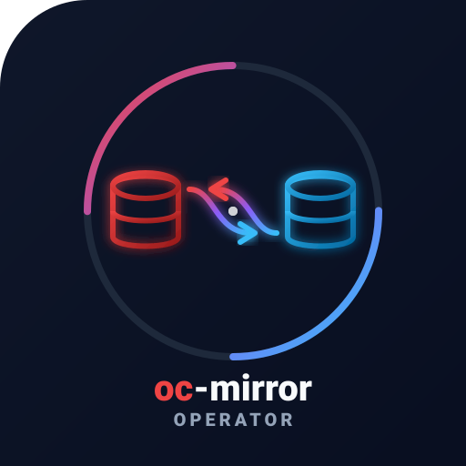

<p align="center">
  
</p>

# oc-mirror-operator

A Kubernetes operator that **continuously mirrors OpenShift releases, OLM operator
catalogs, Helm chart images and arbitrary container images into a private registry**.

Where the `oc-mirror` CLI is a one-shot tool you run by hand, this operator runs in
the cluster and keeps the mirror in sync: you declare *what* you want mirrored in two
custom resources, the operator resolves the image list, copies the images with a pool of
worker pods, watches upstream for new versions, verifies that the target registry still
has everything, and generates the `ImageDigestMirrorSet`/`ImageTagMirrorSet`/
`CatalogSource` resources a disconnected cluster needs to consume the mirror.

```yaml
apiVersion: mirror.openshift.io/v1alpha1
kind: ImageSet                     # WHAT to mirror
metadata: { name: ocp-4-16, namespace: mirror }
spec:
  mirror:
    platform:
      channels:
        - name: stable-4.16
          minVersion: "4.16.20"
    operators:
      - catalog: registry.redhat.io/redhat/redhat-operator-index:v4.16
        packages:
          - name: web-terminal
    additionalImages:
      - name: registry.redhat.io/ubi9/ubi:latest
---
apiVersion: mirror.openshift.io/v1alpha1
kind: MirrorTarget                 # WHERE to mirror it
metadata: { name: internal-registry, namespace: mirror }
spec:
  registry: registry.example.com/mirror
  authSecret: registry-creds
  imageSets: [ocp-4-16]
```

## Highlights

- **Declarative** — `ImageSet` describes content, `MirrorTarget` describes the target
  registry. Edit the spec, the mirror follows.
- **Complete OpenShift support** — Cincinnati channel resolution with version ranges and
  shortest upgrade paths, all ~190 release component images per architecture, KubeVirt container disks,
  OSUS graph-data image, GPG-verified release payloads.
- **Smart operator catalogs** — FBC filtering per package/channel/version with transitive
  dependency resolution, heads-only default like oc-mirror v2, and a filtered catalog
  image that works with OLM v0 (`CatalogSource`) and OLM v1 (`ClusterCatalog`).
- **Runs unattended** — periodic upstream polling, drift detection against the target
  registry, automatic retries, optional cleanup of images that are no longer needed.
- **Built for large registries** — worker pod pool, blob-reuse-aware mirror ordering,
  disk-buffered uploads for multi-GB layers, no persistent volume required (state lives
  in gzip-compressed ConfigMaps).
- **Ready to consume** — IDMS/ITMS/CatalogSource/ClusterCatalog and release signature
  ConfigMaps via a REST API, an OpenShift Console plugin, Prometheus metrics and alerts.
- **Air-gap friendly** — `MirrorExport` renders the resolved image list and cluster
  resources as downloadable artifacts for transfers by other means.

## Quick start

```bash
# 1. Install the operator via OLM (CatalogSource + Subscription, see docs/getting-started.md)

# 2. Registry credentials for source and target registries
kubectl create namespace mirror
kubectl create secret generic registry-creds \
  --from-file=.dockerconfigjson=$HOME/.docker/config.json \
  --type=kubernetes.io/dockerconfigjson -n mirror

# 3. Declare what and where
kubectl apply -f imageset.yaml -f mirrortarget.yaml      # the two resources shown above

# 4. Watch it work
kubectl get mirrortarget,imageset -n mirror
```

The full walk-through, including how to point a disconnected cluster at the mirror, is in
**[Getting started](docs/getting-started.md)**.

## Documentation

| Read this | When you want to |
|---|---|
| [Getting started](docs/getting-started.md) | Install the operator and run your first mirror end to end |
| [Concepts](docs/concepts.md) | Understand the resources, components and the image lifecycle |
| [Configuring ImageSets](docs/configuration/imagesets.md) | Select releases, operators, Helm charts and additional images |
| [Configuring MirrorTargets](docs/configuration/mirrortarget.md) | Tune the target registry, performance, proxy, CA, storage and exposure |
| [Registry credentials](docs/configuration/credentials.md) | Build the auth secret for source and target registries |
| [Operations](docs/operations.md) | Read status, trigger re-resolution, handle failures, clean up, monitor |
| [Consuming the mirror](docs/consuming-results.md) | Fetch IDMS/ITMS/CatalogSource, use the console plugin, export for air gaps |
| [Troubleshooting](docs/troubleshooting.md) | Diagnose stuck images, auth errors, catalog builds and proxies |
| [Upgrading](docs/upgrades.md) | Upgrade between operator versions |
| [Architecture](docs/architecture.md) | How the controller, manager, workers and jobs fit together |
| [API reference](docs/reference/api.md) | Every CRD field, annotation and condition |
| [Developer guide](docs/developer-guide.md) / [Contributing](docs/contributing.md) | Build, test and contribute |

The [documentation index](docs/README.md) lists everything, including the REST API,
network and metrics references.

## Compatibility with the oc-mirror CLI

| | oc-mirror CLI | oc-mirror-operator |
|---|:---:|:---:|
| OpenShift/OKD release mirroring (channels, version ranges, shortest path, full channel) | ✅ | ✅ |
| Release component images, KubeVirt container disks, OSUS graph-data image | ✅ | ✅ |
| Operator catalogs with package/channel/version filtering and dependency resolution | ✅ | ✅ |
| Filtered catalog image for OLM v0 and v1 | ✅ | ✅ |
| Additional images, Helm chart images, blocked images | ✅ | ✅ |
| Release signature verification, cosign signature/referrer copy | ✅ | ✅ |
| IDMS/ITMS, CatalogSource/ClusterCatalog generation | ✅ | ✅ |
| Continuous mirroring, upstream polling, drift detection, retries | ✗ | ✅ |
| Cleanup of images no longer needed | ✗ | ✅ |
| Console plugin, REST API, Prometheus metrics | ✗ | ✅ |
| Mirror-to-disk / disk-to-mirror archives | ✅ | partial — `MirrorExport` renders artifacts, the copy itself is out of scope |
| Helm local charts, samples, UpdateService CR | ✅ | ✗ |

Known limitations and open issues are tracked on
[GitHub](https://github.com/mariusbertram/oc-mirror-operator/issues).

## Status

The API is `v1alpha1`. Releases are published to `ghcr.io/mariusbertram/oc-mirror-operator-*`
(controller, manager, worker, plugin, bundle) and to the `brtrm-dev-catalog` OLM catalog.
See [CHANGELOG.md](CHANGELOG.md) for release notes.

## License

Apache License 2.0 — see [LICENSE](LICENSE).
